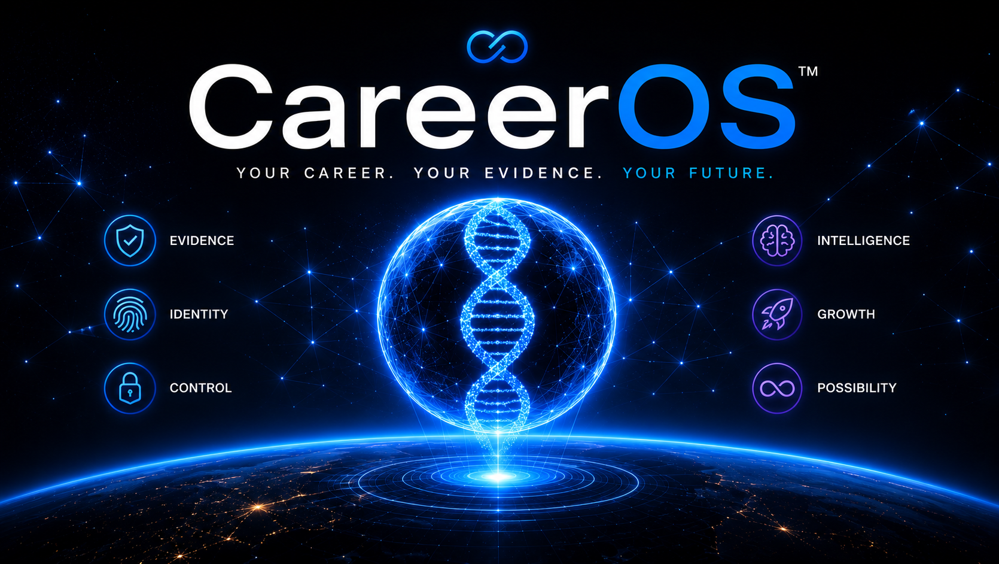
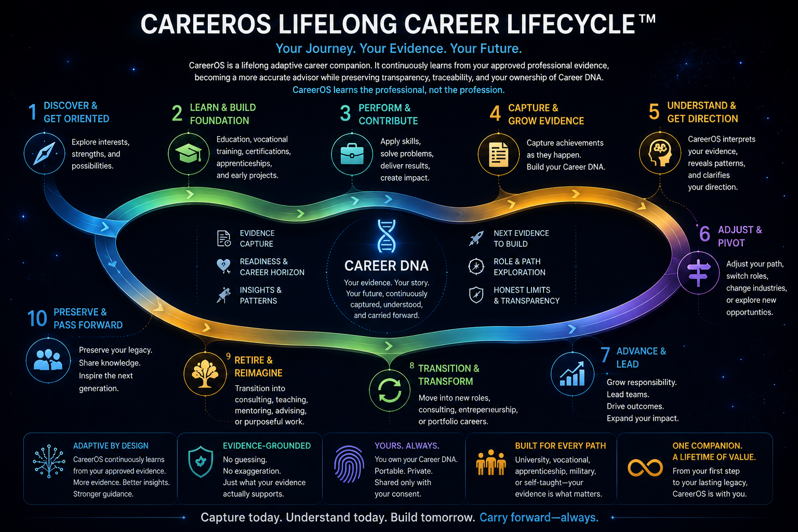
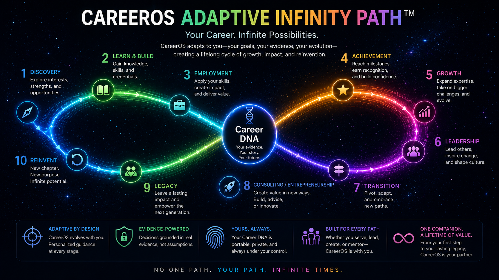

# CareerOS™

A lifelong adaptive career companion and evidence-grounded career intelligence platform.

## Quick Start

Prerequisites: Git, Node.js, and npm.

```text
git clone https://github.com/MishaZoro/careeros-build-week.git
cd careeros-build-week/apps/buildweek-demo
npm install
npm start
```

Open `http://127.0.0.1:4173`.

Run the complete verification suite from `apps/buildweek-demo`:

```text
npm test
```

See [SETUP.md](SETUP.md) for expanded setup and verification instructions. This repository does not currently publish a public live-demo URL.

## Sample Data and Demo Safety

The public Build Week experience uses deterministic demonstration data. Its approved, read-only baseline contains 18 governed demonstration records. The recommended achievement, **AI-enabled Capture Workflow Pilot**, is a synthetic Build Week demonstration record; it is not presented as an actual historical accomplishment.

The demo does not require users to upload private career information. Adding the validated demonstration achievement creates one session record without changing the approved baseline. Reset removes session evidence and restores the deterministic baseline.

## How GPT-5.6 and Codex Were Used

### GPT-5.6

GPT-5.6 helped shape the CareerOS product strategy and translated product observations and screenshots into implementation specifications. It helped define the CareerOS Constitution, evidence rules, classification model, UX behavior, acceptance criteria, demo narrative, and evaluation logic. It also helped analyze failures and define expected behavior. GPT-5.6 did not independently execute repository changes.

### Codex

Codex inspected the actual repository, identified the relevant files and root causes, and implemented HTML, CSS, JavaScript, state-model, and documentation changes. It repaired the guided-demo flow, unified walkthrough and product state, added or updated tests, and ran validation and browser checks. Codex also supported Git status, commit, push, and synchronization with `origin/main`.

### Combined workflow

Screenshots and observed behavior were reviewed with GPT-5.6, which produced precise specifications and acceptance criteria. Codex then inspected and edited the repository. Automated and browser testing exposed remaining failures, and the implementation was iterated until the deterministic nine-step flow worked correctly. Changes were committed and pushed only after human verification.

## Key Decisions and Technical Lessons

- Evidence must precede generation.
- Direct, adjacent, transferable, caution, and unsupported experience remain distinct.
- Limitations stay visible until new evidence genuinely resolves them.
- Guide state and application state use one shared state model.
- Action-required steps cannot be bypassed by a generic Next button.
- Adding evidence is idempotent.
- Reset restores every dependent field.
- Scrolling never mutates guided state.
- The user remains the owner and approval authority for Career DNA.

## Verified Deterministic Demo

The nine-step walkthrough uses **Director of Growth, Advanced Technology**. It begins at 78% readiness. Adding the validated synthetic session record exactly once changes active session records from 0 to 1, readiness from 78% to 82%, and AI pilot leadership from Adjacent to Direct. The retained advanced-domain limitation remains visible, and the 18-record approved baseline remains unchanged.

---

# CareerOS Brand™



---

# Career Lifecycle™



---

# Career Galaxy™


---

# Career Constellation™


---

# Career Path™



---

## Documentation

These documents provide supplementary detail; the critical setup, safety, workflow, and development information is included above.

1. [Product Overview](docs/PRODUCT_OVERVIEW.md)
2. [Setup](SETUP.md)
3. [Demo Script](docs/BUILD_WEEK_DEMO_SCRIPT.md)
4. [Commercial Story](docs/COMMERCIAL_STORY.md)
5. [Why CareerOS Exists](WHY_CAREEROS.md)
